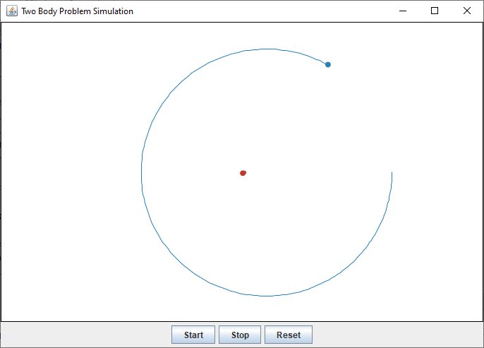
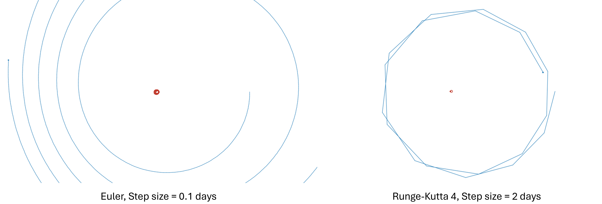

# Planetary Harmonics and Integrator Testbed (PHIT)

| Author | Institution | Date |
|:---|:---|:---|
| Etienne Gubler | Zurich University of Applied Sciences | Oct. 2019 - Nov. 2019 |

## Description

Simulation tool to **visualize** the two-body problem of the **Earth-Moon system**. Two numerical methods (Runge-Kutta and Euler) have been implemented for **solving the system of ordinary differential equations** (ODEs). Various parameters of the gravitation law can be adjusted to change the orbit of the Earth and Moon.

## Project Structure

- Project report (German): [PHIT_Project-Report.pdf](./docs/report/PHIT_Project-Report.pdf)
- IntelliJ IDEA project root: [intellij/PHIT/](./intellij/PHIT/)
- Main srouce file: [TwoBodyProblem.java](./intellij/PHIT/src/ch/gubleet/phit/TwoBodyProblem.java)
- Renderings: [res/renderings/](./res/renderings/)

## Screenshots

### Developed Simulation Tool with GUI

### Simulations with Varying Exponent of the Force Law (&alpha;)

### Simulations with Varying Numerical Methods and Step Sizes

